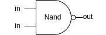
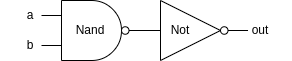
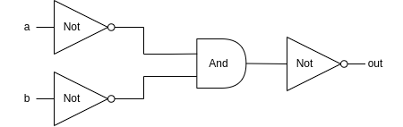
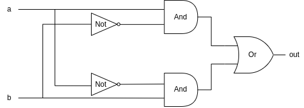
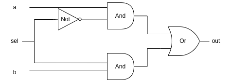
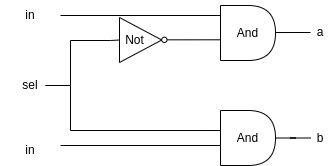

# 从 Nand 到 Tetris 「1」—— Why Nand And Solution of Project 1

> "Simplicity is the ultimate sophistication." – Leonardo da Vinci

## 一些术语

1. 布尔值：包括 true(或称1) 和 false(或称0)；
2. 真值表：用于表示在不同的参数取值下，布尔函数的不同结果；
3. 布尔表达式：产生布尔值的表达式，非真即假，如 1==1 为真，1!=1 为假；
4. 布尔函数：以布尔值作为参数，并且返回布尔值，如 OR, AND, NOT 等；
5. HDL：Hardware Description Language, 硬件描述语言。

## 布尔函数的表达

计算机接收、传输和处理数据是建立在对布尔值的操作上的（电子计算机使用高电平和低电平分别表示为真值 1 和 非真值 0），因此，布尔函数极其重要，可以说，计算机内部所有的计算都可以归结于布尔函数的计算，所以，我们需要思考如何准确表达布尔函数。

### 一个定理

任何布尔函数，无论多么复杂，都可以仅使用 **And 和 Not** 进行表示。

证明如下（选读）：

对于布尔函数 $f(x_1, x_2, ..., x_n)$。

$$f(x_1, x_2, ..., x_n) = (x_n ∧ f(x_1, x_2, ..., 1) ∨ (¬x_n ∧ f(x_1, x_2, ..., 0)))$$

即：假如 $x_n=1$，那么 $f$ 退化为 $f(x_1, x_2, ..., 1)$，假如 $x_n=0$，那么 $f$ 退化为 $f(x_1, x_2, ..., 0)$。

因此，布尔函数 $f$ 最终可完全使用 **And, Or 和 Not** 进行构造。

又有： $x ∨ y = ¬(¬x ∧ ¬y)$。

因此，得证。

### 认识 Nand

**Nand(Not And)** 的真值表如下。

|x|y|value|
|:--:|:--:|:-:|
|0|0|1|
|0|1|1|
|1|0|1|
|1|1|0|

因此，**And, Or, Not** 可以使用 **Nand** 表示为：

a. **x OR y = (x Nand x) Nand (y Nand y)**

b. **x AND y = NOT(x NAND y)**

c. **Not(x) = (x NAND x)**

因此，我们可以得出结论：一旦我们构造出 **Nand**，我们就可以构造出一切布尔函数。

## Hardware Description Language (HDL)

目前，硬件工程师在开发硬件时，常常使用 HDL 编写要构造的计算机元件，然后将其载入硬件模拟器，测试其准确性、计算速度、能耗等，待测试完成无误后，再真正的制造该元件。

该课程提供了一个十分简单的但足够强大的硬件模拟器（现实世界的模拟器要复杂的多），由此，我们并不需要学习电力知识，也能像编写软件那样构造计算机元件。下面对在本课程使用的 HDL 进行简单的介绍。

### 介绍 HDL

1. 文件类型：`.hdl`
2. HDL 是声明式语言，而非命令式语言，其用于描述计算机元件的结构，因此代码顺序并不重要
3. 注释：// or /\* multi-line comments \*/ or /** API documention */
4. 大小写敏感

HDL 包括两部分：interface 和 implementation。

```hdl
// --------interface start---------
CHIP And {
    IN a, b;
    OUT out;
// --------interface end--------
    PARTS:
// --------implementation start---------
    // Put your code here:
    Nand(a=a,b=b,out=mid);
    Not(in=mid,out=out);
// --------implementation end-----------
}
```

interface part 中：

1. **And** 为该元件的名字
2. **a, b** 为元件的输入值
3. **out** 为元件的输出值

implementation part 中：

1. **out=mid** 表示将 **Nand** 的输出赋值给 mid
2. **out=out** 表示将 **Not** 的输出赋值给该计算机元件的输出 out

我们只能修改 implementation part。

本课程使用的 HDL 十分简单，我将在具体的 Project 中对一些不好理解的地方进一步介绍，你也可以查看 [Hardware Description Language](https://drive.google.com/file/d/1dPj4XNby9iuAs-47U9k3xtYy9hJ-ET0T/view) 获取更多信息。

## Project 1: 编写基础计算机元件

注意：解法已经测试无误，但仅供参考，请先自己完成之后，思考之后再查看。

### 1. Not

当输入值 in 为 0 时，返回 1，否则返回 0。



```hdl
CHIP Not {
    IN in;
    OUT out;

    PARTS:
    // Put your code here:
    Nand(a = in, b = in, out = out);
}
```

### 2. And

当输入值 a, b 均为 1 时，返回 1，否则返回 0。



```hdl
CHIP And {
    IN a, b;
    OUT out;

    PARTS:
    // Put your code here:
    Nand(a = a, b = b, out = mid);
    Not(in = mid, out = out);
}
```

### 3. Or

当输入值 a, b 存在 1 时，返回 1，否则返回 0。


```hdl
CHIP Or {
    IN a, b;
    OUT out;

    PARTS:
    // Put your code here:
    Not(in = a, out = aout);
    Not(in = b, out = bout);
    And(a = aout, b = bout, out = about);
    Not(in = about, out = out);
}
```

### 4. Xor

当输入值 a, b 具有不同值时，Xor 返回 1，否则返回 0。



```hdl
CHIP Xor {
    IN a, b;
    OUT out;

    PARTS:
    // Put your code here:
    Not(in = a, out = aout);
    Not(in = b, out = bout);

    And(a = a, b = bout, out = mid1);
    And(a = b, b = aout, out = mid2);

    Or(a = mid1, b = mid2, out = out);
}
```

### 5. Mux

当输入值 sel 为 0 时，返回 a，否则返回 b。



```hdl
CHIP Mux {
    IN a, b, sel;
    OUT out;

    PARTS:
    // Put your code here:
    Not(in = sel, out = mid);
    And(a = a, b = mid, out = mid1);
    And(a = b, b = sel, out = mid2);
    Or(a = mid1, b = mid2, out = out);
}
```

### 6. DMux

当输入值 sel 为 0 时，返回值 a 等于 in，b 等于 0; 否则返回值 a 等于 0，b 等于 in。



```hdl
CHIP DMux {
    IN in, sel;
    OUT a, b;

    PARTS:
    // Put your code here:
    And(a = sel, b = in, out = b);
    Not(in = sel, out = mid);
    And(a = mid, b = in, out = a);
}
```

### 7. Not16

对于输入值 in，out[i] = Not(in[i]);

```hdl
CHIP Not16 {
    IN in[16];
    OUT out[16];

    PARTS:
    // Put your code here:
    Not(in = in[0], out = out[0]);
    Not(in = in[1], out = out[1]);
    Not(in = in[2], out = out[2]);
    Not(in = in[3], out = out[3]);
    Not(in = in[4], out = out[4]);
    Not(in = in[5], out = out[5]);
    Not(in = in[6], out = out[6]);
    Not(in = in[7], out = out[7]);
    Not(in = in[8], out = out[8]);
    Not(in = in[9], out = out[9]);
    Not(in = in[10], out = out[10]);
    Not(in = in[11], out = out[11]);
    Not(in = in[12], out = out[12]);
    Not(in = in[13], out = out[13]);
    Not(in = in[14], out = out[14]);
    Not(in = in[15], out = out[15]);
}
```

### 8. And16

对于输入值 a, b, out[i] = a[i] and b[i];

```hdl
CHIP And16 {
    IN a[16], b[16];
    OUT out[16];

    PARTS:
    // Put your code here:
    And(a = a[0], b = b[0], out = out[0]);
    And(a = a[1], b = b[1], out = out[1]);
    And(a = a[2], b = b[2], out = out[2]);
    And(a = a[3], b = b[3], out = out[3]);
    And(a = a[4], b = b[4], out = out[4]);
    And(a = a[5], b = b[5], out = out[5]);
    And(a = a[6], b = b[6], out = out[6]);
    And(a = a[7], b = b[7], out = out[7]);
    And(a = a[8], b = b[8], out = out[8]);
    And(a = a[9], b = b[9], out = out[9]);
    And(a = a[10], b = b[10], out = out[10]);
    And(a = a[11], b = b[11], out = out[11]);
    And(a = a[12], b = b[12], out = out[12]);
    And(a = a[13], b = b[13], out = out[13]);
    And(a = a[14], b = b[14], out = out[14]);
    And(a = a[15], b = b[15], out = out[15]);
}
```

### 9. Or16

对于输入值 a, b, out[i] = a[i] or b[i];

```hdl
CHIP Or16 {
    IN a[16], b[16];
    OUT out[16];

    PARTS:
    // Put your code here:
    Or(a = a[0], b = b[0], out = out[0]);
    Or(a = a[1], b = b[1], out = out[1]);
    Or(a = a[2], b = b[2], out = out[2]);
    Or(a = a[3], b = b[3], out = out[3]);
    Or(a = a[4], b = b[4], out = out[4]);
    Or(a = a[5], b = b[5], out = out[5]);
    Or(a = a[6], b = b[6], out = out[6]);
    Or(a = a[7], b = b[7], out = out[7]);
    Or(a = a[8], b = b[8], out = out[8]);
    Or(a = a[9], b = b[9], out = out[9]);
    Or(a = a[10], b = b[10], out = out[10]);
    Or(a = a[11], b = b[11], out = out[11]);
    Or(a = a[12], b = b[12], out = out[12]);
    Or(a = a[13], b = b[13], out = out[13]);
    Or(a = a[14], b = b[14], out = out[14]);
    Or(a = a[15], b = b[15], out = out[15]);
}
```

### 10. Mux16

对于输入值 a, b, sel:

1. 当 sel=0，out = a
2. 否则 out = b;

```hdl
CHIP Mux16 {
    IN a[16], b[16], sel;
    OUT out[16];

    PARTS:
    // Put your code here:
    Mux(a = a[0], b = b[0], sel = sel, out = out[0]);
    Mux(a = a[1], b = b[1], sel = sel, out = out[1]);
    Mux(a = a[2], b = b[2], sel = sel, out = out[2]);
    Mux(a = a[3], b = b[3], sel = sel, out = out[3]);
    Mux(a = a[4], b = b[4], sel = sel, out = out[4]);
    Mux(a = a[5], b = b[5], sel = sel, out = out[5]);
    Mux(a = a[6], b = b[6], sel = sel, out = out[6]);
    Mux(a = a[7], b = b[7], sel = sel, out = out[7]);
    Mux(a = a[8], b = b[8], sel = sel, out = out[8]);
    Mux(a = a[9], b = b[9], sel = sel, out = out[9]);
    Mux(a = a[10], b = b[10], sel = sel, out = out[10]);
    Mux(a = a[11], b = b[11], sel = sel, out = out[11]);
    Mux(a = a[12], b = b[12], sel = sel, out = out[12]);
    Mux(a = a[13], b = b[13], sel = sel, out = out[13]);
    Mux(a = a[14], b = b[14], sel = sel, out = out[14]);
    Mux(a = a[15], b = b[15], sel = sel, out = out[15]);
}
```

### 11. Or8Way

对于输入值 in, out = Or(in[0], in[1], ..., in[7]);

```hdl
CHIP Or8Way {
    IN in[8];
    OUT out;

    PARTS:
    // Put your code here:
    Or(a = in[0], b = in[1], out = mid1);
    Or(a = mid1, b = in[2], out = mid2);
    Or(a = mid2, b = in[3], out = mid3);
    Or(a = mid3, b = in[4], out = mid4);
    Or(a = mid4, b = in[5], out = mid5);
    Or(a = mid5, b = in[6], out = mid6);
    Or(a = mid6, b = in[7], out = out);
}
```

### 12. Mux4Way16

对于输入值 a, b, c, d, sel:

1. 当 sel=00, out=a
2. 当 sel=01, out=b
3. 当 sel=10, out=c
4. 当 sel=11, out=d;

```hdl
CHIP Mux4Way16 {
    IN a[16], b[16], c[16], d[16], sel[2];
    OUT out[16];

    PARTS:
    // Put your code here:
    Mux16(a = a, b = c, sel = sel[1], out=aorc);
    Mux16(a = b, b = d, sel = sel[1], out=bord);

    Mux16(a = aorc, b = bord, sel = sel[0], out = out);
}
```

### 13. Mux8Way16

对于输入值 a, b, c, d, e, f, g, h, sel:

1. 当 sel=000, out=a
2. 当 sel=001, out=b
3. 当 sel=010, out=c
4. ...
5. 当 sel=111, out=h

```hdl
CHIP Mux8Way16 {
    IN a[16], b[16], c[16], d[16],
       e[16], f[16], g[16], h[16],
       sel[3];
    OUT out[16];

    PARTS:
    // Put your code here:
    Mux4Way16(a = a, b = b, c = c, d = d, sel = sel[0..1], out = mid1);
    Mux4Way16(a = e, b = f, c = g, d = h, sel = sel[0..1], out = mid2);

    Mux16(a = mid1, b = mid2, sel = sel[2], out = out);
}
```

### 14. DMux4Way

对于输入值 in, sel:

1. 当 sel=00, a=in, b=c=d=0
2. 当 sel=01, b=in, a=c=c=0
3. 当 sel=10, c=in, a=b=d=0
4. 当 sel=11, d=in, a=b=c=0

```hdl
CHIP DMux4Way {
    IN in, sel[2];
    OUT a, b, c, d;

    PARTS:
    // Put your code here:
    DMux(in = in, sel = sel[0], a = mida, b = midb);
    DMux(in = mida, sel = sel[1], a = a, b = c);
    DMux(in = midb, sel = sel[1], a = b, b = d);
}
```

### 15. DMux8Way

对于输入值 in, sel:

1. 当 sel=000, a=in, b=c=d=e=f=g=h=0
2. 当 sel=001, b=in, a=c=d=e=f=g=h=0
3. 当 sel=010, c=in, a=b=d=e=f=g=h=0
4. ...
5. 当 sel=111, h=in, a=b=c=d=e=f=g=0

```hdl
CHIP DMux8Way {
    IN in, sel[3];
    OUT a, b, c, d, e, f, g, h;

    PARTS:
    // Put your code here:
    DMux4Way(in = in, sel = sel[0..1], a = mid1, b = mid2, c = mid3, d = mid4);
    DMux(in = mid1, sel = sel[2], a = a, b = e);
    DMux(in = mid2, sel = sel[2], a = b, b = f);
    DMux(in = mid3, sel = sel[2], a = c, b = g);
    DMux(in = mid4, sel = sel[2], a = d, b = h);
}
```

## 总结

本文首先指出布尔函数对于计算机系统设计的重要性，并且基于 Nand 使用 HDL 对 And, Or, Not, Xor, Mux, DMux 等 15 个基础元件进行了构造，这是我们构造计算机系统的第一步，也是十分关键的一步。

源码见 [github](https://github.com/Civitasv/nand2teris/tree/master/projects/01)。
