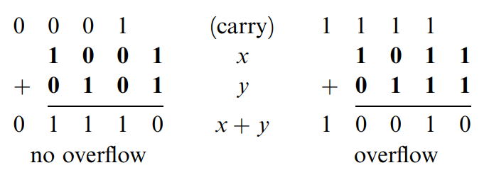
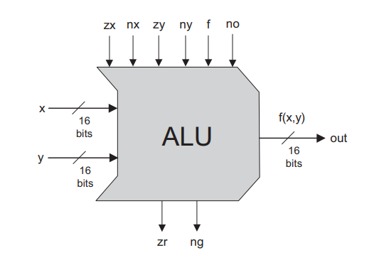

# 从 Nand 到 Tetris 「2」—— Boolean Arithmetic

> Counting is the religion of this generation, its hope and salvation.
>
> ——Gertrude Stein (1874-1946)

[从 Nand 到 Tetris 「1」—— Why Nand And Solution of Project 1](../week%201/Boolean%20Logic.md) 一文中详细阐述了基于 Nand 对 And, Or, Not, Xor, Mux, DMux 等 15 个基础元件的构造。下面我们将基于这些元件构造算术逻辑单元（Arithmetic Logical Unit）。

## 二进制数

计算机内部使用二进制数表示日常使用的十进制数。如 $10_{(10)}$ 用二进制表示为：$1010_{(2)}$。因此当我们在屏幕中输入 10 时，32 位计算机会在某处使用 `00000000000000000000000000001010` 存储该值。

## 二进制加法

二进制加法与十进制类似，从右至左，依次相加，进位即可。例如：



从图片可以看出二进制数字的相加可以转化为以下步骤：

1. 处于第 1 位的两个数字相加，计算得到结果和进位值；
2. 处于第 2 位的两个数字与进位值相加，计算得到结果和进位值；
3. 处于第 3 位...；
4. 处于第 n 位的两个数字与进位值相加，计算得到结果和进位值，若进位值为 1，则说明结果溢出，否则计算完成。

因此，我们需要编写两个元件以：

1. 计算两个数字相加；
2. 计算三个数字相加。

## 有符号数

二进制中，n 个数位共可以表示 $2^n$ 个数。因此，如果想要使用二进制表示有符号数，只需要将这些数分成两个子集，其中一个集合表示正数，另一个集合表示负数。

目前，计算机内部均使用 **2的补码（2's Complement）** 表示负数，这样可以使用一种电路实现全部整数的加法。该方法用公式表示为：

$$
\overline{x}=
\begin{cases}
2^n - x, x \not ={0}\\
0 \\
\end{cases}
$$

举例来说，+8 在 8 位计算机中表示为二进制的 00001000，-8 表示为 8 的补码，即 2^8-8，用二进制即表示为 11111000。

## 算术逻辑单元



ALU 是本计算机中执行算术运算和逻辑运算的核心元件。该元件接受 8 个参数，其中 x, y 为入参，随 6 个控制变量值的不同，ALU 将选取不同的函数操作输入值 x, y，具体见下表。

|zx|nx|zy|ny|f|no|out|
|:-:|:-:|:-:|:-:|:-:|:-:|:-:|
|if zx then x = 0| if nx then x=!x|if zy then y=0|if ny then y=!y|if f then out=x+y else out=x&y|if no then out=!out|f(x,y)=|
|1|0|1|0| 1| 0| 0|
|1|1|1|1| 1| 1| 1|
|1|1|1|0| 1| 0| -1|
|0|0|1|1| 0| 0| x|
|1|1|0|0| 0| 0| y|
|0|0|1|1| 0| 1| !x|
|1|1|0|0| 0| 1| !y|
|0|0|1|1| 1| 1| -x|
|1|1|0|0| 1| 1| -y|
|0|1|1|1| 1| 1| x+1|
|1|1|0|1| 1| 1| y+1|
|0|0|1|1| 1| 0| x-1|
|1|1|0|0| 1| 0| y-1|
|0|0|0|0| 1| 0| x+y|
|0|1|0|0| 1| 1| x-y|
|0|0|0|1| 1| 1| y-x|
|0|0|0|0| 0| 0| x&y|
|0|1|0|1| 0| 1| x\|y|

依赖于作者优雅的设计，此 ALU 既简洁而又强大。

## 实现

### Half-Adder


其中 sum=LSB of a+b，carry=MSB of a+b，其中LSB 为 least significant bit，为右侧数字，MSB 为 most significant bit，为左侧数字。

异或也叫半加运算，其运算法则相当于不带进位的二进制加法。即：

1. 0 xor 0 = 0
2. 1 xor 0 = 1
3. 0 xor 1 = 1
4. 1 xor 1 = 0

因此可以使用异或计算得到 sum 值，使用与运算符计算得到 carry 值。

```hdl
CHIP HalfAdder {
    IN a, b;    // 1-bit inputs
    OUT sum,    // Right bit of a + b 
        carry;  // Left bit of a + b

    PARTS:
    // Put you code here:
    Xor(a=a,b=b,out=sum);
    And(a=a,b=b,out=carry);
}
```

### Full-Adder


```hdl
CHIP FullAdder {
    IN a, b, c;  // 1-bit inputs
    OUT sum,     // Right bit of a + b + c
        carry;   // Left bit of a + b + c

    PARTS:
    // Put you code here:
    HalfAdder(a=a,b=b,sum=midsum,carry=midcarry);
    HalfAdder(a=midsum,b=c,sum=sum,carry=midcarry2);
    Or(a=midcarry,b=midcarry2,out=carry);
}
```

### Adder

类似于 10 进制加法。

```hdl
CHIP Add16 {
    IN a[16], b[16];
    OUT out[16];

    PARTS:
    // Put you code here:
    HalfAdder(a=a[0],b=b[0],sum=out[0],carry=carry1);
    FullAdder(a=a[1],b=b[1],c=carry1,sum=out[1],carry=carry2);
    FullAdder(a=a[2],b=b[2],c=carry2,sum=out[2],carry=carry3);
    FullAdder(a=a[3],b=b[3],c=carry3,sum=out[3],carry=carry4);
    FullAdder(a=a[4],b=b[4],c=carry4,sum=out[4],carry=carry5);
    FullAdder(a=a[5],b=b[5],c=carry5,sum=out[5],carry=carry6);
    FullAdder(a=a[6],b=b[6],c=carry6,sum=out[6],carry=carry7);
    FullAdder(a=a[7],b=b[7],c=carry7,sum=out[7],carry=carry8);
    FullAdder(a=a[8],b=b[8],c=carry8,sum=out[8],carry=carry9);
    FullAdder(a=a[9],b=b[9],c=carry9,sum=out[9],carry=carry10);
    FullAdder(a=a[10],b=b[10],c=carry10,sum=out[10],carry=carry11);
    FullAdder(a=a[11],b=b[11],c=carry11,sum=out[11],carry=carry12);
    FullAdder(a=a[12],b=b[12],c=carry12,sum=out[12],carry=carry13);
    FullAdder(a=a[13],b=b[13],c=carry13,sum=out[13],carry=carry14);
    FullAdder(a=a[14],b=b[14],c=carry14,sum=out[14],carry=carry15);
    FullAdder(a=a[15],b=b[15],c=carry15,sum=out[15],carry=carry16);
}
```

### Incrementer

相当于 `in + 0000000000000001`。

```hdl
CHIP Inc16 {
    IN in[16];
    OUT out[16];

    PARTS:
    // Put you code here:
    HalfAdder(a=in[0],b=true,sum=out[0],carry=carry1);
    HalfAdder(a=in[1],b=carry1,sum=out[1],carry=carry2);
    HalfAdder(a=in[2],b=carry2,sum=out[2],carry=carry3);
    HalfAdder(a=in[3],b=carry3,sum=out[3],carry=carry4);
    HalfAdder(a=in[4],b=carry4,sum=out[4],carry=carry5);
    HalfAdder(a=in[5],b=carry5,sum=out[5],carry=carry6);
    HalfAdder(a=in[6],b=carry6,sum=out[6],carry=carry7);
    HalfAdder(a=in[7],b=carry7,sum=out[7],carry=carry8);
    HalfAdder(a=in[8],b=carry8,sum=out[8],carry=carry9);
    HalfAdder(a=in[9],b=carry9,sum=out[9],carry=carry10);
    HalfAdder(a=in[10],b=carry10,sum=out[10],carry=carry11);
    HalfAdder(a=in[11],b=carry11,sum=out[11],carry=carry12);
    HalfAdder(a=in[12],b=carry12,sum=out[12],carry=carry13);
    HalfAdder(a=in[13],b=carry13,sum=out[13],carry=carry14);
    HalfAdder(a=in[14],b=carry14,sum=out[14],carry=carry15);
    HalfAdder(a=in[15],b=carry15,sum=out[15],carry=carry16);
}
```

### ALU

```hdl
CHIP ALU {
    IN  
        x[16], y[16],  // 16-bit inputs        
        zx, // zero the x input?
        nx, // negate the x input?
        zy, // zero the y input?
        ny, // negate the y input?
        f,  // compute out = x + y (if 1) or x & y (if 0)
        no; // negate the out output?

    OUT 
        out[16], // 16-bit output
        zr, // 1 if (out == 0), 0 otherwise
        ng; // 1 if (out < 0),  0 otherwise

    PARTS:
    // Put you code here:
    // if zx then x=0
    Mux16(a=x,b=false,sel=zx,out=transx);

    // if nx then x=!x
    Not16(in=transx,out=nottransx);
    Mux16(a=transx,b=nottransx,sel=nx,out=resultx);

    // if zy then y=0
    Mux16(a=y,b=false,sel=zy,out=transy);

    // if ny then y=!y
    Not16(in=transy,out=nottransy);
    Mux16(a=transy,b=nottransy,sel=ny,out=resulty);

    // if f then out=x+y
    //      else out=x&y
    Add16(a=resultx,b=resulty,out=xplusy);
    And16(a=resultx,b=resulty,out=xandy);
    Mux16(a=xandy,b=xplusy,sel=f,out=fresult);

    // if no then out=!out
    Not16(in=fresult,out=notfresult);
    Mux16(a=fresult,b=notfresult,sel=no,out=out,out[15]=outlessthanzero,out[0..7]=firsthalf,out[8..15]=lasthalf);


    Or8Way(in=firsthalf,out=firstequalszero);
    Or8Way(in=lasthalf,out=lastequalszero);
    Or(a=firstequalszero,b=lastequalszero,out=outnotequalzero);

    // if out=0 then zr=1 else zr=0
    Mux(a=true,b=false,sel=outnotequalzero,out=zr);

    // if out<0 then ng=1 else ng=0
    Mux(a=false,b=true,sel=outlessthanzero,out=ng);
}
```

## 总结

基于 Project 1 设计的元件，本文介绍了 Adder、Incrementer 及 ALU 的实现方式，源码见 [project 2](https://github.com/Civitasv/nand2teris/tree/master/projects/02)。

