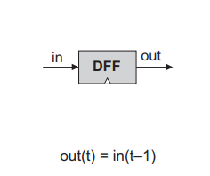
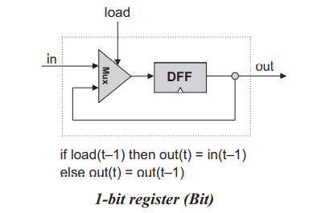
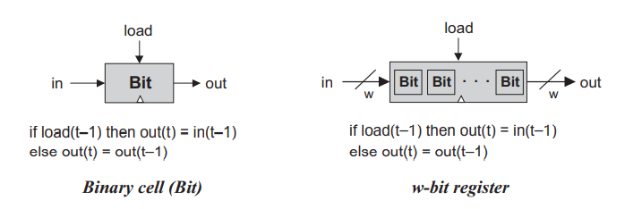
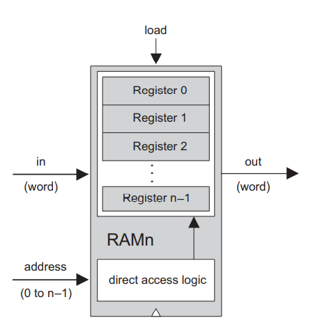
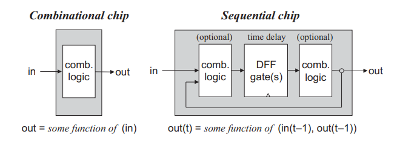

# Sequential Logic

第一章和第二章的元件都是 `combinational` 的，结果值只与输入值相关。但他们没办法表示状态 `state`。

计算机不只要计算数据，还要能够保存和调用数据，所以需要设计内存，保存数据。

*flip-flops*: 底层 sequential gates.

## 概念

**The Clock:** 时间的流逝是由一个主时钟来表示的，它传送一个连续的交替信号序列。硬件层面，是使用振荡器，在 0-1, low-high, tick-tock 之间交替。tick 与 tock 之间的时间称为 `cycle`，这样的一个 `cycle` 就成为一个 `time unit`，借助硬件电路，该信号就被广播到整个电脑中了。

**Flip-Flops:** 计算机中最基础的 Sequential element，本书中使用它的一个变体 —— data flip-flop，DFF，其输入为主时钟的信号和数据，输出为下一 cycle 的信号和数据，即 `out(t) = in(t-1)`。

  

**Registers:** 能够存储数据的元件，即`out(t) = out(t-1)`。

存储一个 bit:

扩展为 register:

  

**Memories:** Random Access Memomry, Or RAM.

  

**Counters:** 计数器，`out(t) = out(t-1) + c`。

**Time Matters:** 以上的所有元件都是 sequential 的，在 DDF 的基础上建立，要么用于保存数据，要么用于更新数据。

All we have to do is ensure, when we build the computer’s clock, that the length of the clock cycle will be slightly longer that the time it takes a bit to travel the longest distance from one chip in the architecture to another.

  
