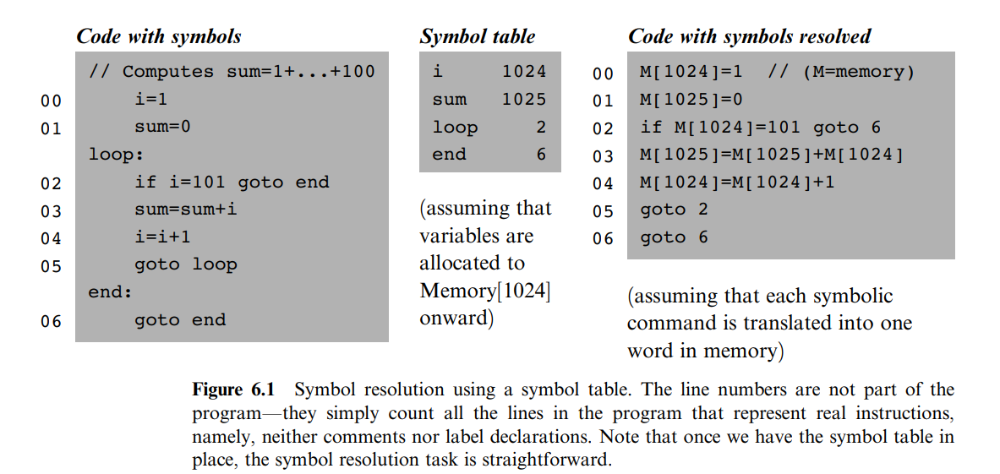

# Assembler

> What's in a name? That which we call a rose by any other name would smell as weet.

我们已经完成了硬件部分的构造，下面让专注于计算机的软件架构，最终完成编译器、操作系统和一门面向对象语言。

软件架构中最基础的是汇编编译器，其用于将汇编语言编译为可以在 Hack 上运行的机器码。

## Symbols

- Variables: 汇编编译器会自动将变量存储到内存中
- Labels: 用于标识某行，使用括号 ()

  

## 编写汇编编译器

1. 一次扫描：获取所有的 label symbol
2. 二次扫描：获取所有的 variable symbol
3. 编译为机器码
