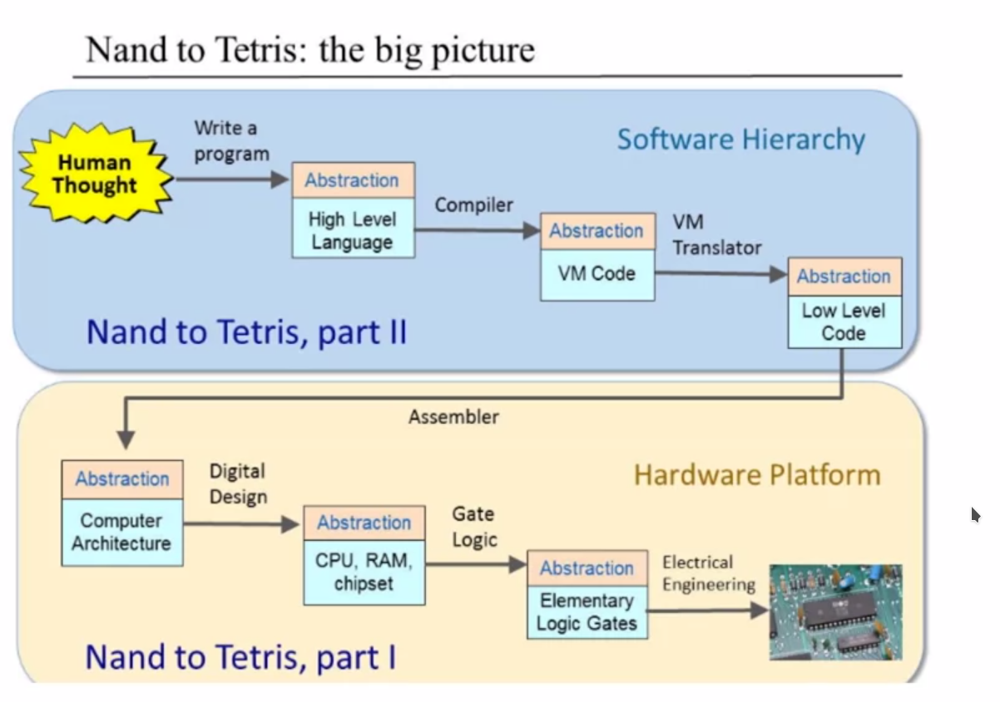

# 从 Nand 到 Tetris 「0」

> What I hear, I forget; What I see, I remember; What I do, I understand.  
> ——Confucius, 551-479 BC

这是一门由 Prof. Shimon Schocken 和 Prof. Noam Nisan 在 Coursera 中开设的课程，配套图书是 *The Elements of Computer Systems*，课程从底而上，从最基础的逻辑门 Nand 到实现俄罗斯方块 Tetris，从硬件到软件，系统构建了计算机系统。

计算机已成为人类文明的重要组成部分，购物、出行、饮食、居住环境无一不与计算机息息相关，因此，为充分适应社会，不只是程序员，所有人都应该大致了解计算机的构造，认识计算机的行为，而不是不负责任的，简单的将计算机当作黑匣子，认为其中发生了某种魔法。

学习任何技能，最简单，最复杂也是最有效的方式就是实践，同样的，学习计算机运行原理的最好方式当然就是亲手去实现一个。无论多么宏伟的建筑，多么美丽的画作，多么动听的音乐，究其根本，也是由泥土、三原色、音符组成的，这是无法修改的规则。同样的，尽管现代计算机已经如此复杂，如此强大，但其也是由十分原始的逻辑门组成的。二位教授在此课程中逐步构建了一个简单的但也足够强大的计算机系统，随着一步步的构建，我们将建立对计算机构造原理基本的认识，尽管其不能与现代计算机相提并论，但基本原理是相似/相同的，剩下要做大都是“优化”（也十分重要）。虽然其仅仅是一个十分简单的计算机系统，但也是相当复杂的，因此，在此过程中，我们还将学习到如何基于「抽象」构建可维护的大型软硬件系统。

## 课程结构

第一部分中，课程主要关于如何设计计算机系统的硬件部分，从最原始的逻辑门出发，基于给出的 Nand 门设计 CPU, RAM, ROM 以及其他逻辑门如 OR, AND, NOT 等，接着，基于 CPU, RAM, ROM 等设计出完整的计算机硬件系统。注意，计算机科学并不包括电子科学与技术，因此，我们并不怎么关心使用电力等知识真正的“制作”逻辑门，在此课程中，我们使用硬件模拟软件（课程提供，事实上，目前硬件工程师也大都是使用硬件模拟软件进行硬件的设计）测试逻辑门的正确性。

第二部分中，课程基于已设计的计算机硬件系统，开发软件系统，主要包括汇编语言的设计、Virtual Machine 的设计、高级编程语言的设计等，最后使用此高级编程语言，开发俄罗斯方块或其它程序。

## 总结

这篇文章是 **从 Nand 到 Tetris** 系列的引子，我将在以后的文章中分享我在学习这门课程中学到的知识，遇到的问题以及我的思考。
