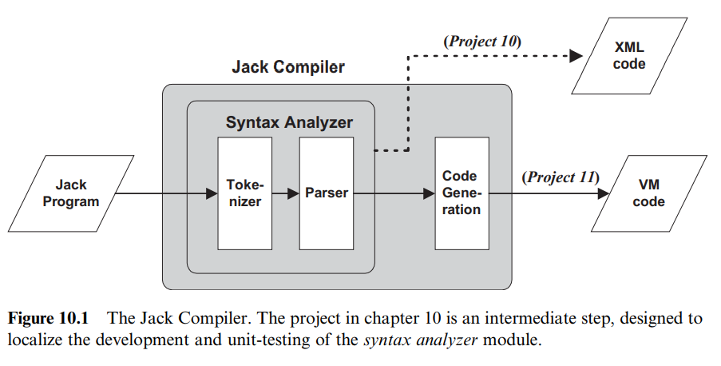
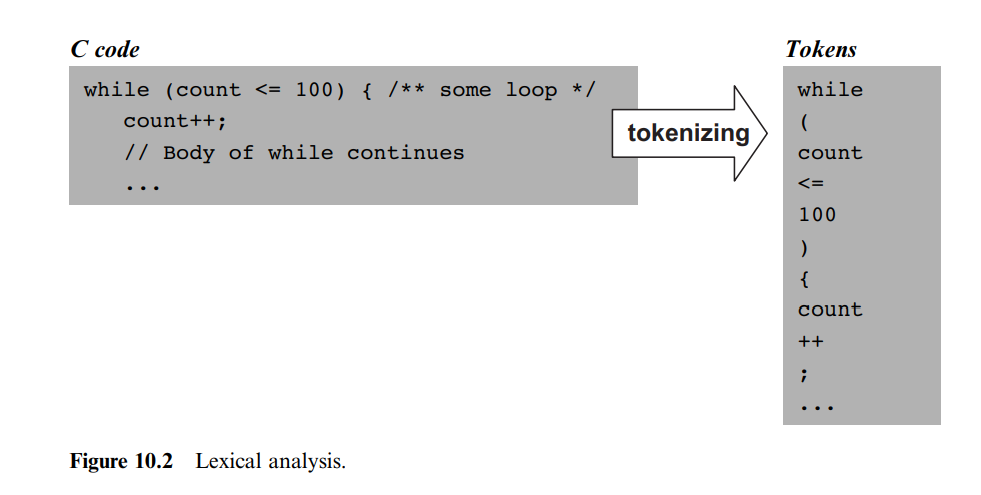
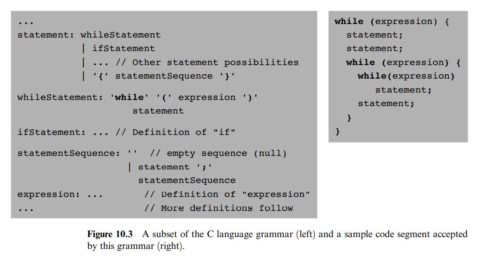
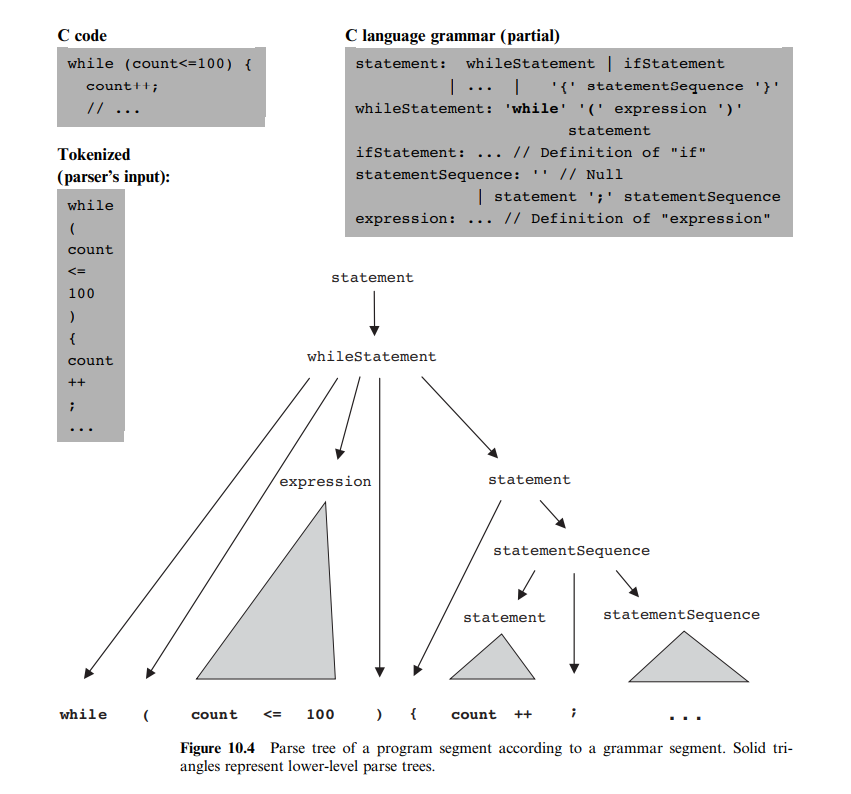
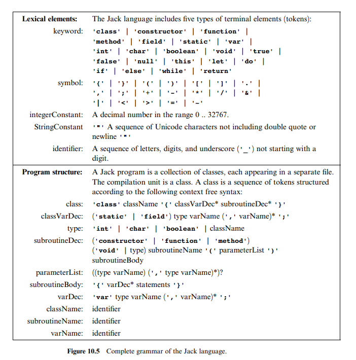
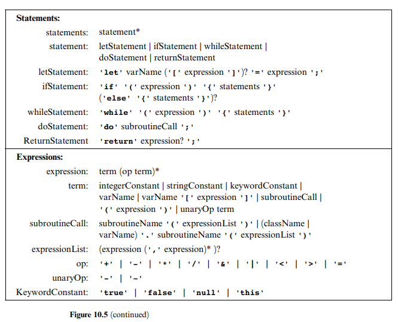

# Compiler I: Syntax Analysis

> Neither can embellishments of language be found without arrangement and expression of thoughts, nor can thoughts be made to shine without the light of language.
> Cicero(106-43 BC)

编译器的作用是将原始语言翻译为目标语言，主要分为两个步骤：

1. Syntax analysis: 理解程序的语法(syntax)，如将 if...else... 理解为分支语法。
2. Code generation: 根据语法，理解程序的语义(semantic)，生成对应的代码，即 reconstruct the program's logic using the syntax of the target language。

  

本章主要介绍 Syntax Analysis.

> 这样说我之前写的 SICP 里面的 Scheme 变体的编译器应该不叫编译，或许叫 emulator 更为合适，毕竟我是在 Scheme 中执行该变体，生成代码的过程隐含在其中了。
> 这也就像该课程提供的 Vm emulator 类似，它不仅要进行 Syntax Analysis，还需要直接在 java 环境中**执行**这些代码。
> 仔细想想，各种 emulator 也都是这个思路，解析原始代码，想办法在目标平台上执行这些代码。
> 但编译是不一样的，按我目前理解应该只是将一门语言（偏高级）翻译为另一门语言（偏低级），但不负责运行，而是由编译的目标平台执行这些代码。

## Background

Syntax Analysis 又包括两个模块：

1. tokenizing: 标记输入字符
2. parsing: 解析 token

### Lexical Analysis

> In its plainest syntactic form, a program is simply a sequence of characters, stored in a text file. The first step in the syntax analysis of a program is to group the characters into tokens (as defined by the language syntax), while ignoring white space and comments. This step is usually called lexical analysis, scanning, or tokenizing.

  

### Grammars

将输入解析为 tokens 后，我们要设法将这些 tokens 按照规定的语法格式组合为变量声明、statement、expression 等。

  

### Parsing

> The act of checking whether a grammar ‘‘accepts’’ an input text as valid is called parsing.

解析的输出结果是 `parse tree` 或 `derivation tree`。

  

**Recursive Descent Parsing** The top-down approach, also called recursive descent parsing, attempts to parse the tokens stream recursively, using the nested structure prescribed by the language grammar.

  
  
