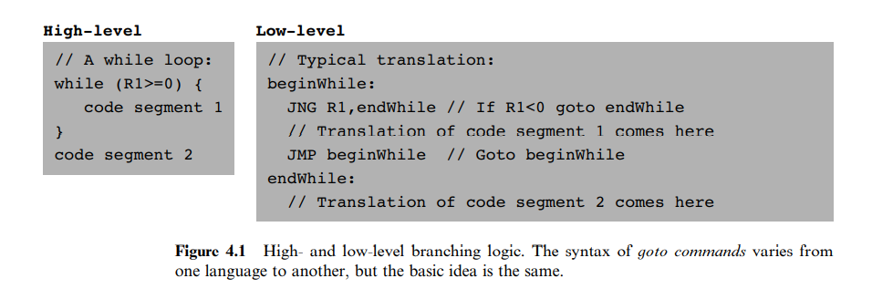
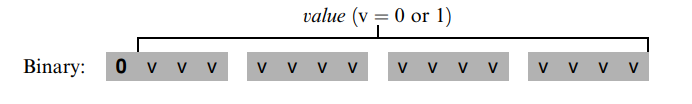
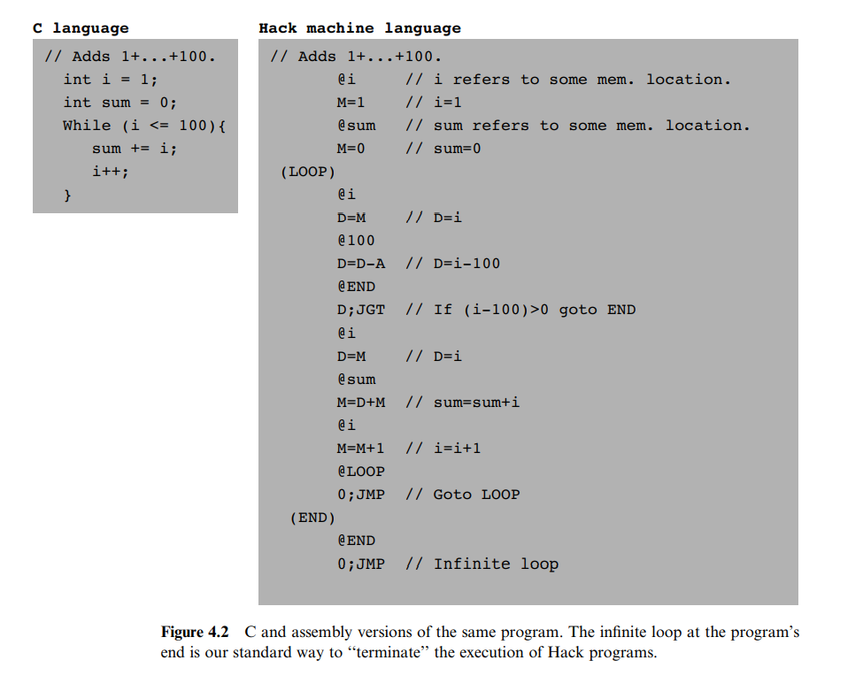
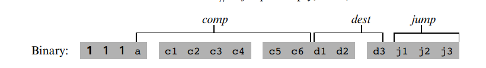

# Machine Language

> Make everything as simple as possible, but not simpler.

本章介绍了 Hack 电脑的机器语言。

> Machine language is the most profound interface in the overall computer enterprise—the fine line where hardware and software meet. This is the point where the abstract thoughts of the programmer, as manifested in symbolic instructions, are turned into physical operations performed in silicon.

How romantic!

## Background

### Machines

机器语言可以看作一种共识，被设计来使用处理器和寄存器操作内存。

**Memory:** 指硬件中存储数据和指令的区域，具有唯一地址。

**Processor:** Central Processing Unit or CPU，是一组固定的基本运算，包括逻辑运算，数学运算，内存操作，分支等。

**Registers:** 内存操作相对来说很慢，因此，许多处理器会提供一些寄存器，每个能够保存一个数据，数据访问的效率很高。

### Languages

1. 使用汇编语言编写代码，操作数据
2. 使用编译器将汇编语言编译为机器码，实际执行

### Commands

**Arithmetic and Logic Operations:** 基础的相加、相减、布尔运算、位运算等。

```asm
ADD R2,R1,R3 // R2<---R1+R3 where R1,R2,R3 are registers
ADD R2,R1,foo // R2<---R1+foo where foo stands for the
// value of the memory location pointed
// at by the user-defined label foo.
AND R1,R1,R2 // R1<---bit wise And of R1 and R2
```

**Memomry Access:** 有如下几种寻址策略：

- Direct addressing: 最普遍的方式是直接使用特定的地址，如 `LOAD R1. 67` 表示 `R1<---Memomry[67]`
- Immediate addressing: 用于加载常量，如 `LOADI R1, 67` 表示 `R1<---67`
- Indirect addressing: 间接寻址，不直接使用硬编码表示特定的地址，而是使用某个特定的内存存储地址，其实就是指针。

```asm
// Translation of x=foo[j] or x=*(foo+j):
ADD R1,foo,j // R1<---foo+j
LOAD* R2,R1 // R2<---Memory[R1]
STR R2,x // x<---R2
```

**Flow of Control:**

  

## Hack Machine Language Spec

Hack 计算机为 16 位计算机，包括一个 CPU，两个内存模块（一个存储指令，一个存储数据），两个输入输出设备（屏幕和键盘）。

### Memory Address Spaces

一块指令内存，一块数据内存。 Both memories are 16-bit wide
and have a 15-bit address space, meaning that the maximum addressable size of each memory is 32K 16-bit words.

### registers

两个 16 bit 寄存器，D 和 A，其中 D 纯粹用于存储数据，A 可以存储数据，也可以作为存储指针。

Since Hack instructions are 16-bit wide, and since addresses are specified using 15 bits, it is impossible to pack both an operation code and an address in one instruction. Thus, the syntax of the Hack language mandates that memory access instructions operate on an implicit memory location labeled ‘‘M’’, for example, D=M+1. In order to resolve this address, the convention is that M always refers to the memory word whose address is the current value of the A register. For example, if we want to effect the operation D = Memory[516] - 1, we have to use one instruction to set the A register to 516, and a subsequent instruction to specify D=M-1.

同时，寄存器 A 还担任着跳转行的作用。

### A-instruction

A-instruction: `@value`, which is used to set the A register to a 15-bit value.

  

三个作用：

1. 存储常量；
2. 指定 C-instruction 要处理的数据所在的内存地址；
3. 指定跳转位置。

  

### C-instruction

核心所在。几乎所有的处理都在该命令中进行。

1. what to compute
2. where to store the computed value
3. what to do next

```bash
C-instruction: dest=comp;jump // Either the dest or jump fields may be empty
                              // If dest is empty, the "=" is omitted
                              // If jump is empty, the ";" us omitted
```

  

  
