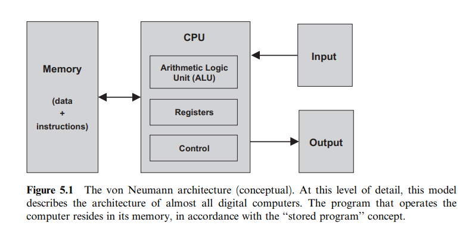
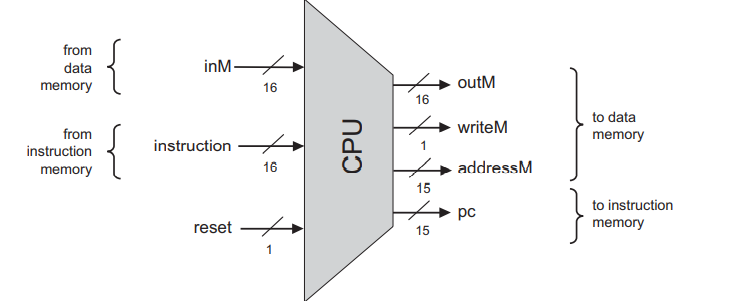
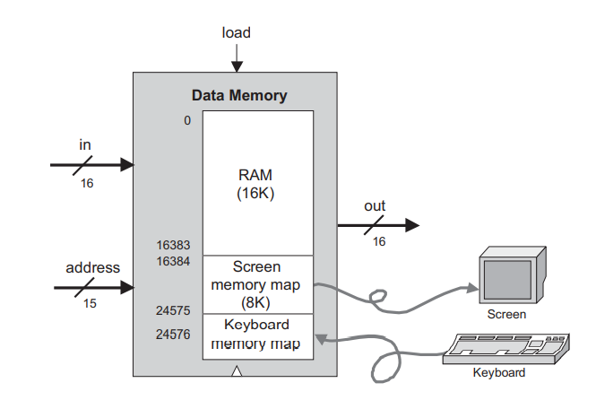

# Computer Architecture

## Background

计算机最特别的性质是它能够执行几乎无限多的任务，如此的灵活性来源于一个绝妙的想法——存储程序。

程序并不内嵌于硬件，而是加载进计算机的存储程序之中，就像数据一样，由此，计算机就可以根据加载程序的不同，执行不同的任务。

### 冯·诺依曼架构

  

1. CPU: 与存储设备交互（这里应该是硬盘和内存），从输入设备中获取信息，并通过输出设备向外传递信息。
2. 存储设备: 存储计算中的数据，存储程序。

### Memory

两种数据：计算中产生的数据和计算机程序。

### Central Processing Unit

是计算机的核心。控制如何执行程序。

**ALU:** 执行逻辑和数学运算

**Registers:** 寄存器，很快

**Control Unit:** 解析程序

### Registers

寄存器，被设计来用于高效率处理。

1. Data registers
2. Addressing registers
3. Program counter registers

### Input and Output

核心思想是将硬件设备与计算中的存储块一一对应。这样，操作硬件设备，即是更改对应存储区域的数据罢了。

  

  
