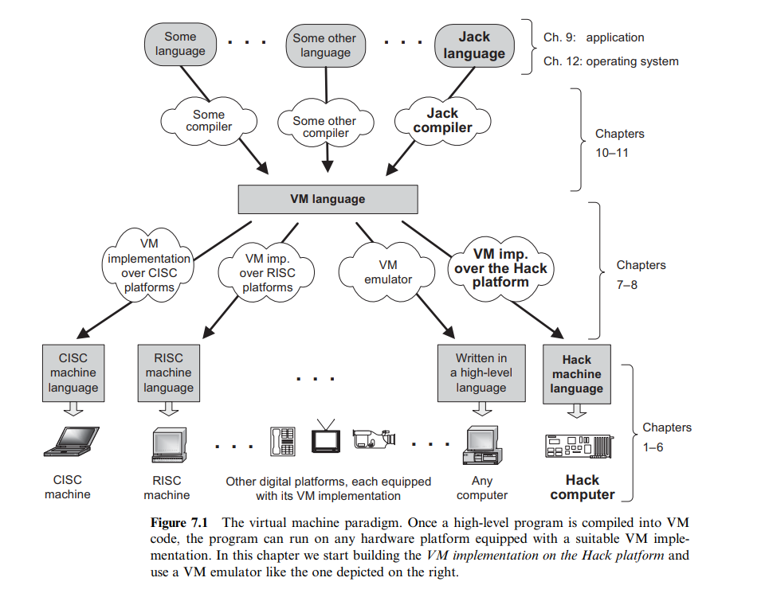
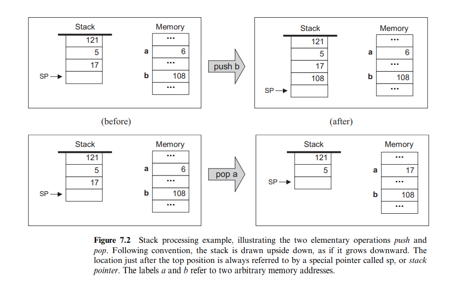
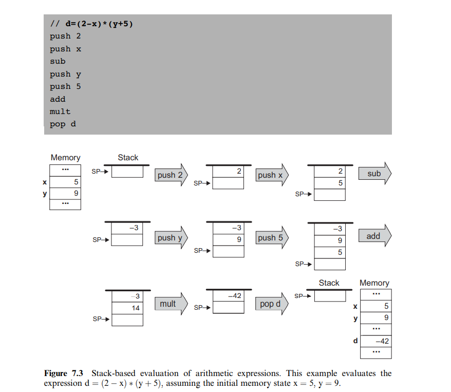

# Virtual Machine I: Stack Arithmetic

> Programmers are creators of universes for which they alone are responsible. Universes of virtually unlimited complexity can be created in the form of computer programs.

:fire: 本章描述构建面向对象高级语言编译器的第一步。

我们将分两个阶段完成这个任务：

1. 将高级语言转化为“中间”代码（chapter 10 & 11）
2. 将“中间”代码转化为机器语言（chapter 7 & 8）

## Background

### The Virtual Machine Paradigm

高级语言若想在计算机上运行，首先要将其转化为对应的机器码，即编译。

  

### The Stack Machine Model

  

**Stack Arithmetic:** 加减乘除而已，leetcode 算法刷到过。

  
