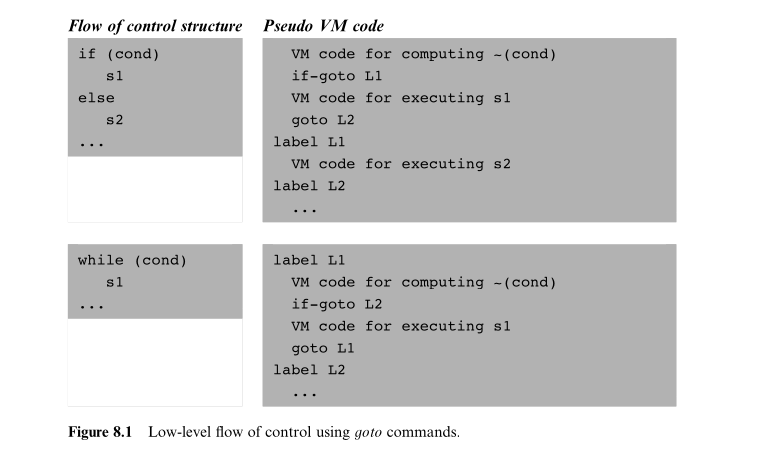
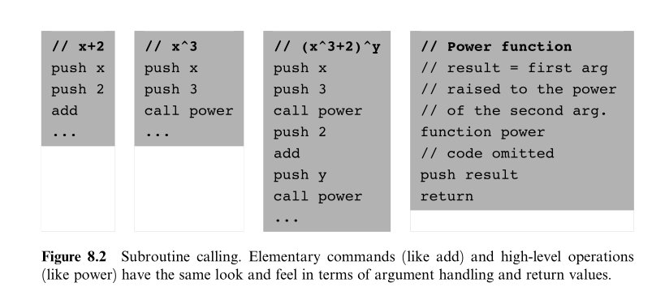
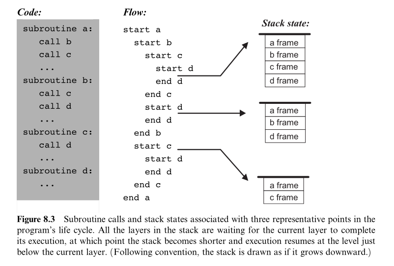
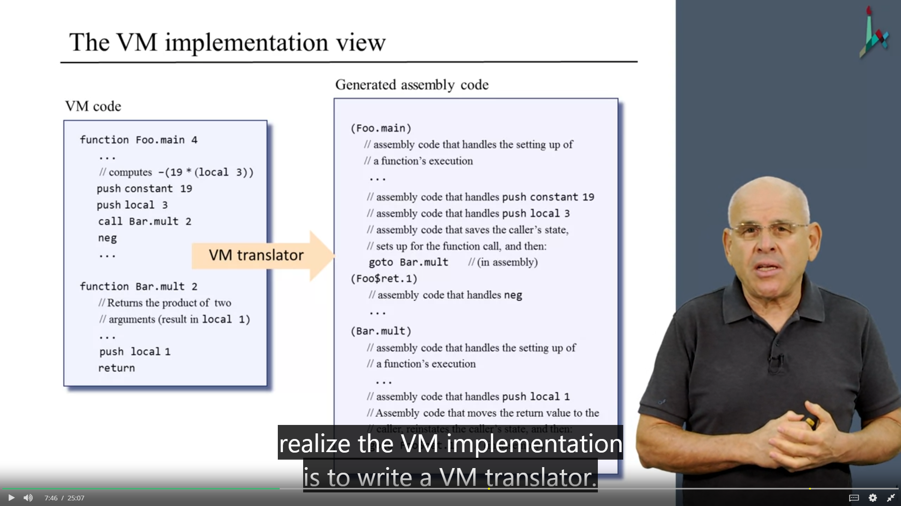
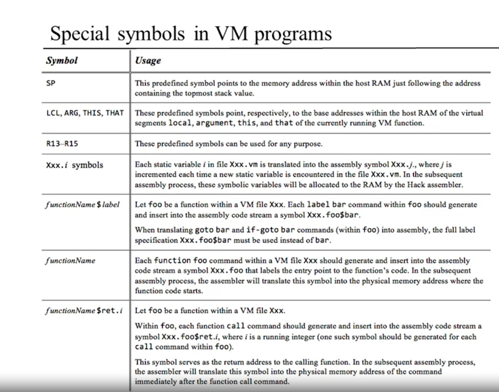

# Virtual Machine II: Program Control

> If everything seems under control, you're just not going fast enough.
> Mario Andretti (b. 1940), race car champion.

本章介绍如何使用 Stack Machine 实现函数调用，分支等。

## Program Flow

  

## Subroutine Calling

subroutines, procesures, or functions.

  

  

## VM Spec

### Program Flow Commands

- label *label*
  
  ```hack
  (label)
  ```

- goto *label*

  ```hack
  @label
  0;JMP
  ```

- if-goto *label*

  ```hack
  @SP
  AM=M-1
  D=M
  @label
  D;JNE
  ```

### Function Calling Commands

Facinating part.

  

- function *f* *n*

  ```hack
  (functionName)
  repeat nVars times: push 0 // 初始化局部变量为 0
  ```

- call *f* *m*

  ```hack
  push returnAddress // Using the label declared below
  push LCL  // Saves LCL of the caller
  push ARG  // Saves ARG of the caller
  push THIS // Saves THIS of the caller
  push THAT // Saves THAT of the caller

  ARG = SP-5-nArgs // Repositions ARG，指示参数开始的位置
  LCL = SP  // Repositions LCL，指示局部变量开始的位置
  
  goto functionName // Transfers control to the called function
  (returnAddress) // Declares a label for the return-address
  ```

- return

  ```hack
  endFrame = LCL // endFrame 是 temporary variable
  retAddr = *(endFrame - 5) // 获得返回的地址
  *ARG = pop() // 将返回值存储到 ARG[0]，刚好是调用函数后函数需要返回的地方，因为 ARG=SP-5-nArgs
  SP = ARG + 1 // Repositions SP of the caller
  THAT = *(endFrame - 1) // Restores THAT of the caller
  THIS = *(endFrame - 2)
  ARG = *(endFrame - 3)
  LCL = *(endFrame - 4)
  goto retAddr // goes to return address in the caller's code
  ```

  
