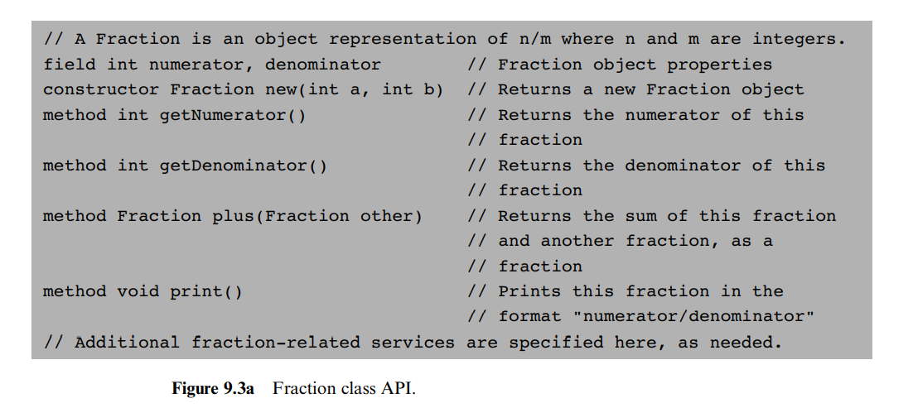

# High-Level Language

> High thoughts need a high language.

## Background

### 1. Hello World

1. 函数执行入口为 `Main.main`

```jack
/** Hello World program. */
class Main {
  function void main() {
    /* Prints some text using the standard library. */
    do Output.printString("Hello World");
    do Output.println(); // New line
    return;
  }
}
```

### 2. Procedural Programming and Array Handling

  

### 3. Abstract Data Types

1. primitive data types: `int`, `char`, `boolean`

对当前对象的操作应使用 `method`，对当前类的操作应使用 `function`，构造方法使用 `constructor`。

  

  

  

### 4. Linked List Implementation

  

  

  

## The Jack Language Spec

### Syntactic Elements

A. White space and comments

comment formats:

```jack
// Comment t end of line
/* Comment until closing */
/** API documentation comment */
```

B. Symbols

1. `( )`: group arithmetic expressions, enclose parameter-lists and argument-lists
2. `[ ]`: 数组索引
3. `{ }`: group program units and statements
4. `,`: 变量分隔符
5. `;`: Statement terminator
6. `=`: 赋值和比较运算符
7. `.`: Class membership
8. `+, -, *, /, &, |, ~, <, >`

C. Reserved words

1. `class, constructor, method, function`: Program components
2. `int, boolean, char`: Primitive types
3. `var, static, field`: Variable declarations
4. `let, do, if, else, while, return`: Statements
5. `true, false, null`: 常量
6. `this`: Object reference
7. `void`: just void

D. Constants

1. `Integer`: 必须是正数，负数则是表达式，例如 (- 12)
2. `String`: 使用 "" 表示字符串
3. `Boolean`: true 或 false
4. `null`: 空引用

E. Identifiers

第一个字符必须是字母或者 `_`，大小写敏感。

### Program Structure

Jack 中的基础单元是 `class`，每一个类在一个文件中，格式如下：

```jack
class name{
  Field and static variable declarations // 必须在 subroutine 之前

  Subroutine declarations // 包括 constructor, method, function
}
```

Subroutine 的格式为：

```jack
subroutine type name(parameters) {
  local variable declarations
  statements
}
```

其中 subroutine 可能为 constructor, method 或者 function.

### Variables

Jack 中包括 `field, static, local, paramter` 四种变量作用域。

1. `static`: Class level
2. `field`: Object level
3. `local`: Subroutine level
4. `paramter`: Subroutine level

  

  

Built-in Object Types:

1. Arrays: 可以包括不同的数据类型, a[j]
2. Strings: `var String s`

Jack 是一种弱类型语言。

### Statements

  

### Expressions

  

### Subroutine Calls

1. functions: 需要使用 full names, `className.subroutineName(args)`
2. methods: Class 内可以直接使用 `methodName(args)` 调用，外部需要使用 `varName.methodName(args)` 调用。

类实例的建立分为两个阶段：

1. 声明，`var String s`，此时仅初始化指针
2. 调用 constructor，分配内存空间

### 标准库

1. Math: 基础数学计算
2. String: 字符串计算
3. Array: 数组相关
4. Output: 向屏幕中输出 text
5. Screen: 向屏幕中输出 graphic
6. Keyboard: 处理键盘输入
7. Memory: 处理内存操作
8. Sys: execution-related services

## Jack OS

Hack 的操作系统，Jack OS 是使用 Jack 语言写成的，主要是封装了一系列常用算法，如图形绘制，数学计算等，这跟现代计算机很类似，以 Linux 为例，其操作系统大部分是使用 C++ 写成的，因此我们的程序可以直接调用“操作系统”中已经封装好的 API 对电脑进行一些操作，可以说“操作系统”是一种十分强大的抽象库。

例如，敲击键盘时，键盘厂商会调用操作系统提供的 API，操作系统再对相应的内存块设置值，这样键盘厂商时不需要知道需要操作哪个内存块的，就算后期内存变更，键盘厂商也不需要更改代码。
